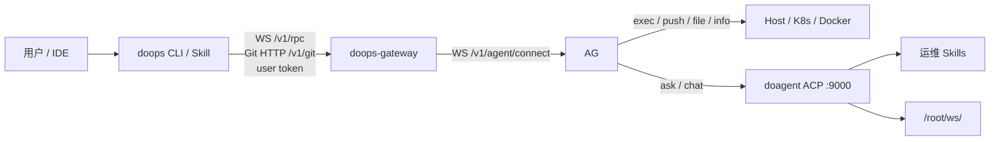

# doops.sh

`doops` 是 SSH 的替代入口。日常使用只走公网 `doops-gateway`，再由 gateway 路由到主动注册的内网 `doops-agent`；不需要 SSH 用户、SSH 端口或 SSH 密码。

## GitHub 发布说明

本仓库的公开发布分支使用脱敏配置：文档和测试中的公网地址、镜像仓库、模型网关和凭据均使用示例占位。真实 gateway token、API key、registry 密码、SSH 凭据和 kubeconfig 必须通过环境变量、Kubernetes Secret 或本机忽略配置提供，不能提交到 git。

标准验证命令：

```bash
(cd agent && go test ./...)
(cd gateway && go test ./...)
(cd skills/doops-cli && go test ./...)
```

## 架构图



系统里有两条正交维度：

- 连接模式：CLI/skill 连接 gateway，内网 agent 主动注册 gateway
- 执行模式：快路径 `exec/read/write/push/pull/info/check/clean`，慢路径 `ask` / 后续 `chat`

组件分工：

- 客户端：`doops` CLI + doops skill
- 公网控制面：`gateway/` 构建 `doops-gateway`，负责 RBAC、审计、排队和内网 agent 路由
- 边缘执行端：`agent/` 构建 `doops-agent`，负责目标机器上的 exec、push/pull、文件和 AI 任务
- 运行安全边界：`doops-agent` 默认只启动 `doops-agent`、`do-agent`、`buildkitd`；默认不启动 SSH，不启动 WebIDE
- 连接方式：CLI/skill 访问 gateway `42222`，gateway 通过已建立的 agent WebSocket 进入内网 agent
- 鉴权方式：用户连接 gateway 使用 gateway user token；agent 注册 gateway 不需要 token，只需要 `gateway-url`、`cluster` 和 `instance`
- 代码同步：gateway 使用 Git HTTP；gateway 只通过已建立的 agent WebSocket 反向隧道透传 Git 请求，不再使用 tar 分块上传作为 `push/pull` 路径
- 镜像构建：统一使用 `buildctl + buildkitd`

## 当前纳管目标

当前统一命名口径：

- `doops-oilan / oilan-node` -> `198.51.100.24`，oilan 集群
- `doops-edu / edu-coder` -> `198.51.100.23`，edu-coder 集群
- `doops-jm / jm-228`
- `doops-zheyin / node-239`
- `doops-114 / vm-114`
- `doops-235 / hdu-235`

不要再把 `oilan` 和 `edu-coder` 混成同一个 cluster。历史名字 `doops-89/master-node` 只作为旧链路排障参考，不再作为当前标准纳管名。

## 当前镜像与协议

当前维护版 agent 采用双镜像发布：

```text
docker.cnb.cool/l8ai/ai/doops.sh/base:v1  # 重基础镜像：sandbox / doagent / buildkit / 系统工具
docker.cnb.cool/l8ai/ai/doops.sh:v1.1       # 轻更新镜像：doops-agent / skills / docs / entrypoint
```

如果目标环境不需要 WebIDE 兼容层，优先使用新的轻量基础镜像构建链：

```text
Dockerfile.base.light                     # 轻量基础镜像：doagent / buildkit / git / tini / bash
docker.cnb.cool/l8ai/ai/doops.sh/base-light:<release>
docker.cnb.cool/l8ai/ai/doops.sh:<release>
```

`base-light` 的目标是作为纯 `doops-agent` 运行时，不再默认继承 WebIDE 启动器，也不保留 SSH 相关默认能力。

镜像构成：

- 基础镜像源码：`Dockerfile.base`
- 更新镜像源码：`Dockerfile` / `agent/Dockerfile`
- 基础镜像来源：由 `Dockerfile.base` 的 `DO_AGENT_IMAGE` 指定，默认使用保留的 doops-agent 基线镜像
- 网关二进制：`/app/doops-agent`
- doagent AI 内核：`/usr/local/bin/do-agent`
- 构建闸门：两个 Dockerfile 都会执行 `/usr/local/bin/do-agent --help`；更新镜像还会执行 `buildctl --version`
- 发布原则：先用受控远端构建发布 `doops.sh/base:<release>`，CNB release 只校验并复用该基础镜像来构建 `doops.sh:<release>`；K8s 默认只滚动 `doops.sh:<release>`。

协议与端点：

- CLI 到 gateway 使用 `WS /v1/rpc?cluster=<cluster>&instance=<instance>`
- 内网 agent 到 gateway 使用 `WS /v1/agent/connect?cluster=<cluster>&instance=<instance>`
- 模型网关地址使用 `https://api.example.com` / `https://api.example.com/v1`，不带 `:8443`

本轮维护已清理的技术债：

- 修复 `agent-entrypoint.sh` 把 `-port/-token` 透传给 WebIDE 启动脚本导致的 `Unknown option -port`
- 将 doagent 依赖镜像改为可覆盖的固定 `DO_AGENT_IMAGE`，默认使用 Harbor 中可拉取的 doops-agent 基线，避免历史 `oilan-system/do-agent:*` tag 缺失阻断构建
- 将 agent 发布拆为 `doops.sh/base:<release>` 和 `doops.sh:<release>`，避免每次代码更新都拉取多 GiB 基础层
- 统一发布脚本与 DaemonSet 默认更新镜像为 `docker.cnb.cool/l8ai/ai/doops.sh:v1.1`
- 关闭默认攻击面：`agent-entrypoint.sh` 改为仅在显式 `DOOPS_ENABLE_SSHD=1` / `DOOPS_ENABLE_WEBIDE=1` 时才启动 SSH 或 WebIDE
- 将核心协议文档统一为 `/ws`
- 将 doagent 旧叙述收敛为当前 doagent ACP HTTP 路径
- 新增多用户多集群 `doops-gateway`：SQLite、user token、scope/action 权限、审计和 gateway Git HTTP 反向隧道
- 统一 `push/pull`：gateway 使用 Git 快照语义，并按 `/v1/git/<cluster>/<instance>/<session>.git` 精确路由到目标 agent
- 加固多人使用：user token 按 token id 单行校验，密码登录 token 默认 24 小时过期，同一 target 默认有界排队串行执行
- 新增 gateway 主动升级：`agent:upgrade` 权限控制，CLI `upgrade` 可按 `cluster/instance` 广播通知在线 agent 更新镜像

## Gateway 代码入口

`doops-gateway` 是一等组件，源码入口在仓库一级目录：

```bash
bash scripts/build-gateway.sh
./bin/doops-gateway serve -db /var/lib/doops-gateway/gateway.db -port 42222
```

兼容入口 `agent/cmd/gateway` 仍保留，但只作为旧构建路径 wrapper；新文档和新部署应使用 `gateway/`。

面向外部系统的 API 使用指南见 [docs/DOOPS_API_GUIDE.md](docs/DOOPS_API_GUIDE.md)，包括登录、目标查询、WebSocket JSON-RPC、自然语言部署、进度流和审计查询。

2026-05-11 gateway 验收状态（历史记录）：

- 公网 gateway：生产标准应使用 TLS 域名；`203.0.113.10:42222` 仅保留作受控实验 smoke，客户端需显式允许不安全 gateway 才能连
- 已接入 target：`doops-114/vm-114`、`doops-jm/jm-228`
- 已验证：`targets`、`exec`、`write/read`、`push`、高危 action 未授权拒绝、90 秒以上 heartbeat 保活
- `ask` 链路已实测到 `doops-agent -> doagent ACP HTTP`：当前 JM 失败原因是 `doagent-config` 里的 `settings.json` 没有有效 `apiKey`，不是 gateway 或 WebSocket 问题
- 89/114/JM 的运行容器命名已统一为标准 `doops-agent`；JM 通过 89 内网路径接入 gateway。

## Agent 双镜像发布

正式发布由 CNB release tag 触发，同一版本会产出两类镜像：

```text
docker.cnb.cool/l8ai/ai/doops.sh/base:<release>
docker.cnb.cool/l8ai/ai/doops.sh:<release>
```

分层边界：

- `doops.sh/base`：sandbox 文件系统、doagent、BuildKit、系统包、通用运行工具；变化频率低，拉取成本高。
- `doops.sh`：`/app/doops-agent`、`/app/skills`、`/app/self-docs`、entrypoint；变化频率高，拉取成本低。

禁止把基础 rootfs 压平成每次 release 都变化的大层。线上升级默认只替换 `doops.sh:<release>`，这样节点已缓存的基础层可以复用，避免 doops-agent 在拉镜像阶段长时间离线。

CNB 非同名制品必须使用仓库下级路径，例如 `docker.cnb.cool/l8ai/ai/doops.sh/base:v1`。不要写成 `docker.cnb.cool/l8ai/ai/doops.sh-base:v1`，那会发布到另一个制品名，也无法被当前 release 流水线复用。

## 固定路径

- CLI：`~/.local/bin/doops`
- Skill 源码权威位置：`skills/SKILL.md`
- Skill 安装目标：`<project>/.agent/skills/doops/SKILL.md`
- CLI 唯一默认配置：`~/.agent/skills/doops/config.json`
- CLI token 缓存：`~/.agent/skills/doops/auth.json`
- 预构建 CLI：`skills/doops-cli/bin/doops-<os>-<arch>`
- Agent local token：服务端 `/root/.doops/agent-token`，只用于遗留直连或本机 `/ws` 保护，不用于 gateway 注册

`~/.config/doops/config.json`、`~/.doops/auth.json` 和项目 `.doops/` 是旧路径或运行痕迹，不能作为当前配置依据。`DOOPS_CONFIG=/path/to/config.json` 只用于测试和应急显式覆盖。

## 安装模型先看这里

Doops 有两件事容易混淆，文档里必须先分开看：

1. **agent 部署形态**：`doops-agent` 在目标机器上怎么跑起来。
2. **连接模式**：CLI/skill 怎么连到这个 agent。

### Agent 部署形态

| 形态 | 怎么识别 | 适用场景 | 是否容器化 |
| :--- | :--- | :--- | :--- |
| K8s/DaemonSet | `kubectl get pod -A -l app=doops-agent` 能看到 Pod | K8s/K3s 集群节点，推荐标准安装 | 是 |
| Docker/nerdctl 容器 | `docker ps` 或 `nerdctl ps` 里有名为 `doops-agent` 的容器 | 单机或没有 DaemonSet 的节点，推荐标准安装 | 是 |
| 裸二进制/systemd | `ps -ef | grep doops-agent` 显示 `/usr/local/bin/doops-agent -port ...`，但没有 Pod/容器 | 临时自举、旧节点兼容 | 否 |

例如某台机器上看到：

```text
/usr/local/bin/doops-agent -port 42222 ...
```

同时 `kubectl get pod -A -l app=doops-agent` 没有 Pod，`docker ps` 也没有 `doops-agent` 容器，就说明它是 **裸二进制直装**，不是 K8s/K3s 镜像安装。裸二进制不会自动获得容器镜像里的 doagent、BuildKit、skills 和自恢复能力；生产环境建议升级成 K8s/DaemonSet 或容器模式。

### Gateway 连接

标准 target 只配置 gateway：

| CLI/skill 连哪里 | 目标 agent 要怎么运行 |
| :--- | :--- |
| `ws(s)://<gateway>/v1/rpc` | 内网 agent 主动 `-gateway-url ... -cluster ... -instance ...` 连公网 gateway |

是否“可以操作某节点”取决于该 agent 是否已经主动注册到 gateway。`doops targets --target <gateway-target>` 能看到对应 `cluster/instance` 在线，后续 `exec/ask/push/pull` 才能成功。如果某节点只是本地二进制直装且没有 `-gateway-url`，它不会自动出现在 gateway 里。

## 客户端安装与连接

### 1. 安装 CLI 和 skill

doops skill 的权威源码在本仓库 `skills/SKILL.md`。不要在用户项目里手写或反向维护 skill；安装脚本只负责把仓库里的 `skills/SKILL.md` 拷贝到业务项目的 `.agent/skills/doops/SKILL.md`。

```bash
git clone https://cnb.cool/l8ai/ai/doops.sh.git
cd doops.sh
bash scripts/install.sh --project /absolute/path/to/your/project
```

这一步会完成：

1. 把对应平台的预构建 CLI 从 doops.sh 仓库的 `skills/doops-cli/bin/doops-<os>-<arch>` 拷贝到 `~/.local/bin/doops`
2. 把 doops.sh 源码里的 `skills/SKILL.md` 安装到 `/absolute/path/to/your/project/.agent/skills/doops/SKILL.md`

如果 `~/.local/bin` 还不在 `PATH`：

```bash
export PATH="$HOME/.local/bin:$PATH"
```

也可以安装时直接写入 gateway 目标配置。

```bash
bash scripts/install.sh \
  --project /absolute/path/to/your/project \
  --target-name jm \
  --target-gateway https://gateway.example.com \
  --target-cluster doops-jm \
  --target-instance jm-228 \
  --target-aliases jy \
  --target-token '<GATEWAY_USER_TOKEN>' \
  --use 'JM via gateway'
```

Skill 会随安装同步到项目目录。标准 target 的配置必须有 `gateway`/`cluster`/`instance`，`token` 是 gateway user token。

- target 支持短名和别名，例如主名 `jm`，别名 `jy`。后续 `doops -session smoke exec --target jy --cmd hostname` 会解析到同一个 `doops-jm/jm-228`。

## Gateway 用户维护

用户、密码、token、授权和审计都由 gateway 统一维护，不保存在业务项目里。

产品层只暴露 `doops` 作为日常入口。发账号、发 token、grant 权限、审计查询、审计清理属于管理员能力，应收敛到 `doops admin ...` 管理入口；业务项目和 skill 不应引导用户直接调用 gateway 内部维护命令。

授权模型：

- 普通 user token 默认拥有所有 target 操作能力；旧库中只授予 `targets:list` 的 scope 也按全功能 target access 兼容，避免“能看到但不能操作”。需要隔离时，再显式收窄 `cluster/instance/action`。
- 全局管理员需要显式授予 `admin` 权限。
- 审计记录按 `user_id`、`token_id`、`cluster`、`instance`、`action`、`session`、`status` 可追溯。

故障判断：

- `401 Unauthorized`：token 无效或过期，认证失败
- `403 Forbidden`：token 有效，但该用户被显式收窄后缺少当前 `cluster/instance/action` 权限，或缺少 gateway 管理员 `admin` 权限

### 2. 通过 gateway 添加内网集群目标

gateway 由管理员维护用户、user token 和授权。agent 注册 gateway 不需要预签发 token；业务侧配置只消费管理员发放的 user token，不直接维护 gateway 数据库。

gateway 支持用户名密码登录，先换取 user token 再用 token 操作：

```bash
doops login --target prod-master --gateway https://gateway.example.com --username alice
```

内网 agent 主动连接公网 gateway：

```bash
doops-agent \
  -gateway-url https://gateway.example.com \
  -cluster prod \
  -instance master-1 \
```

客户端配置 gateway target：

```bash
doops add \
  --name prod-master \
  --gateway https://gateway.example.com \
  --cluster prod \
  --instance master-1 \
  --aliases prod,master \
  --token '<USER_TOKEN>' \
  --use 'prod cluster via gateway'
```

doops 支持 `http` / `https` gateway；`http` 会自动转换为 WebSocket 隧道使用的 `ws`。
公网生产环境建议使用 `https` / `wss`，但 CLI 和 agent 不会因为 gateway 是 HTTP 而拒绝连接。

验证：

```bash
doops targets --target prod-master
doops -session smoke exec --target prod-master --cmd 'hostname'
```

### 3. 验证连接

```bash
doops list
doops targets --target prod-master
doops -session smoke exec --target prod-master --cmd 'hostname'
doops -session smoke ask --target prod-master --msg '用一句话说明当前机器状态'
```

## 服务端安装 Agent

如果 `doops-agent` 已经在目标机器上运行并注册到 gateway，只需要给客户端配置 gateway target 和 gateway user token，不需要 SSH。

SSH 只用于首次把 agent 装到机器上，或者 agent 完全不可用时做自恢复；它不是日常连接方式。

### 安装前先判断当前形态

```bash
kubectl get pod -A -l app=doops-agent -o wide 2>/dev/null || true
docker ps --format '{{.Names}} {{.Image}} {{.Ports}}' 2>/dev/null | grep doops-agent || true
nerdctl ps --format '{{.Names}} {{.Image}} {{.Ports}}' 2>/dev/null | grep doops-agent || true
ps -ef | grep '[d]oops-agent' || true
ss -lntp | grep ':42222' || true
```

判断规则：

- 有 Pod：按 K8s/DaemonSet 管理。
- 有名为 `doops-agent` 的容器：按容器模式管理。
- 只有 `/usr/local/bin/doops-agent -port ...` 进程：这是裸二进制直装，不是容器化安装。
- 只有端口监听但 WebSocket EOF：通常是旧 agent、启动参数不匹配，或被错误进程占用了 42222。

### 方式 A：K8s/DaemonSet 标准安装

适合当前仓库默认的 K3s/containerd 布局。

```bash
kubectl create namespace doops-system --dry-run=client -o yaml | kubectl apply -f -
kubectl -n doops-system create secret generic registry-credentials \
  --from-literal=username="$REGISTRY_USER" \
  --from-literal=password="$REGISTRY_PASS" \
  --dry-run=client -o yaml | kubectl apply -f -
kubectl -n doops-system apply -f agent/agent-config.yaml
kubectl -n doops-system apply -f agent/agent.yaml
```

### 方式 B：Docker/nerdctl 容器标准安装

适合没有 DaemonSet、但可以在宿主机跑容器的节点。容器名必须使用标准名 `doops-agent`。

```bash
docker run -d --name doops-agent \
  --privileged --pid=host --network=host \
  --restart=unless-stopped \
  -v /var/run/docker.sock:/var/run/docker.sock \
  -v /root/.kube:/root/.kube:ro \
  -v /etc/kubernetes:/etc/kubernetes:ro \
  -e DO_AGENT_MODEL='openai/gpt-5.4' \
  docker.cnb.cool/l8ai/ai/doops.sh:v1.1 \
  -port 42222 \
  -gateway-url https://gateway.example.com \
  -cluster prod \
  -instance master-1 \
```

如果目标环境使用 containerd/nerdctl，把 `docker run` 替换为 `nerdctl run`，参数保持一致。启动后验证：

```bash
docker ps --filter name=doops-agent
docker logs --tail=100 doops-agent
curl -fsS http://127.0.0.1:42222/health
```

### 方式 C：一次性 SSH 自举裸二进制

仅在目标机器还没有 `doops-agent`、且需要 SSH 自举裸进程时使用：

```bash
doops install \
  --name gpu-ampere01 \
  --ip 198.51.100.24 \
  --ssh-user root \
  --ssh-password '<SSH_PASSWORD>' \
  --ssh-port 22 \
  --agent-token '<OPTIONAL_AGENT_TOKEN>'
```

`--agent-token` 只服务于遗留裸进程的本机 `/ws` 保护，不是 gateway 注册凭据。自举完成后仍然要用 `-gateway-url ... -cluster ... -instance ...` 接入 gateway，并在客户端配置 gateway target。

注意：`doops install` 当前是 SSH bootstrap/兼容入口，可能把 agent 作为裸二进制或容器拉起，取决于目标机器运行时能力和参数。生产标准化建议优先使用 **方式 A K8s/DaemonSet** 或 **方式 B 容器模式**。

从当前版本开始，`doops install` 不再把“进程起来了”当作安装成功。安装完成后会主动连回新装好的 agent，执行一次能力自检，至少验证：

- agent 本身能响应
- 容器运行时可见（`nerdctl` / `docker` / `podman`）
- `kubectl` 或 kubeconfig 是否可见
- `buildctl` 与 `/run/buildkit/buildkitd.sock` 是否可见

其中 `agent 响应` 和 `容器运行时` 是必需项，失败会直接判定安装失败；`kubectl` 与 `buildkit` 会明确显示 `OK` 或 `MISSING`，避免把半残环境误报为“已可用”。

### 方式 D：维护者发布 `doops-agent`

`deploy.sh` 是维护者发布入口，用于把本仓库里的 agent 镜像构建、推送并滚动更新到集群：

```bash
bash deploy.sh gpu-ampere01
```

它会优先通过已有 doops 连接执行发布。只有目标 agent 不可用时，才读取配置里的 `ssh_user`、`ssh_port`、`ssh_password` 做一次性 SSH 自恢复；agent 连接凭证始终使用 `token`。

## 常用命令

```bash
doops list
doops -session demo exec --target gpu-ampere01 --cmd 'uptime && df -h'
doops -session demo ask --target gpu-ampere01 --msg '检查磁盘和内存压力，给出结论'
doops -session demo push --target gpu-ampere01 --src .
doops -session demo pull --target gpu-ampere01 --dest ./demo-output
doops -session demo write --target gpu-ampere01 --path /root/ws/demo/pod.yaml --file ./pod.yaml
doops -session demo exec --target gpu-ampere01 --cmd 'ls -la /root/ws/demo'
```

常用命令说明：

| 命令 | 说明 |
| :--- | :--- |
| `doops add --gateway --cluster --instance --token` | 添加 gateway target |
| `doops list` | 列出客户端已配置节点 |
| `doops exec` | 在远端 agent 容器内执行确定性命令 |
| `doops ask` | 交给远端 doagent 自主分析和执行 |
| `doops push` | 同步本地代码到 `/root/ws/$SESSION`，尊重 `.gitignore`/`.doopsignore` |
| `doops pull` | 基于 Git 拉取远端 `/root/ws/$SESSION` 工作区到本地 |
| `doops read` | 查看远端小文本文件，不用于下载大文件或二进制 |
| `doops write` | 写入远端小文本文件，支持 `--content`、`--file` 和 stdin |
| `doops clean` | 清理远端工作区 |
| `doops upgrade` | 通过 gateway 对在线 agent 下发镜像升级 |

### 通过 Gateway 批量升级 Agent

用户必须具备 `agent:upgrade` 或 `admin` 权限。建议先 dry-run，再按集群滚动执行：

```bash
doops -session upgrade_20260511 upgrade \
  --target jm \
  --cluster doops-jm \
  --image docker.cnb.cool/l8ai/ai/doops.sh:v1.1 \
  --mode k8s \
  --namespace oilan-system \
  --workload daemonset/doops-agent \
  --container doops-agent \
  --dry-run
```

去掉 `--dry-run` 后会对匹配的在线 `cluster/instance` 下发升级。K8s/DaemonSet 模式会执行 `kubectl set image` 和 `rollout status`；裸二进制 agent 会明确拒绝镜像升级。

## 维护者说明

重新构建并提交多平台 CLI：

```bash
bash scripts/build-cli.sh --all
ls -lh skills/doops-cli/bin/
```

预构建产物固定提交在 `skills/doops-cli/bin/`，安装脚本会从这里拷贝到 `~/.local/bin/doops`。

## 边界

- `doops` 日常连接不依赖 SSH。
- `token` 在标准 target 配置里只表示 gateway user token。
- agent 注册 gateway 不需要 token；`doops-agent token` 只用于遗留直连或本机 `/ws` 保护。
- `ssh_password` 只保留为 SSH bootstrap 参数。
- `bash` 子命令仍是遗留 SSH 交互入口；推荐使用 `doops exec` 和 `doops ask`。
