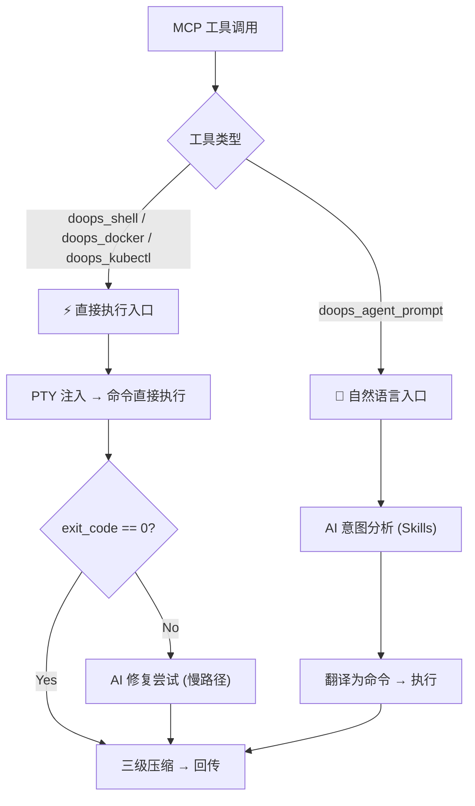

# Edge Agent (agent) 设计文档

`agent` 是部署在每个运维节点的轻量级 **Gateway**，采用 MCP 协议与主控端通信。它不是简单的命令透传器，而是一个具备**分级执行能力**的边缘智能网关。

---

## 1. 核心需求 (Core Requirements)

1.  **宿主机穿透执行**：打破容器隔离，获取与 SSH 登录一致的宿主机管理权限。
2.  **双入口架构**：
    - **直接执行入口**（MCP 工具）：`doops_shell`、`doops_docker`、`doops_kubectl` — 接收明确命令，直接注入 PTY 执行，秒级响应。
    - **自然语言入口**（AI + Skill）：`doops_agent_prompt` — 接收自然语言/模糊意图，交由边缘 AI 结合 Skill（shell、docker、k8s、image-build 等）分析翻译后执行。
3.  **边缘端数据蒸馏**：三级压缩策略，极致节省 Token 和带宽。
4.  **安全审计与管控**："手术刀"式权限控制，默认只读，按需提权。
5.  **云原生 MCP 接口**：基于 WebSocket 的长连接，标准化工具宣告。

---

## 2. 容器权限逃逸与宿主机接管 (Privilege & Host Takeover)

### A. 容器启动配置 (K8s DaemonSet)

| 配置参数 | Docker 等效 | 核心作用 |
| :--- | :--- | :--- |
| `privileged: true` | `--privileged` | **特权模式**。赋予几乎所有 Linux Capabilities，禁用 AppArmor/SELinux，允许访问 `/dev`。 |
| `hostNetwork: true` | `--network=host` | **网络共享**。容器直接使用宿主机 IP，Master 通过 NodeIP 直达 Agent。 |
| Volume Mount (`/:/host`) | `-v /:/host` | **文件系统**。宿主机根目录全量挂载。 |

### B. 容器原生隔离执行
彻底废除宿主机提权（如废弃原先不安全的 `nsenter`）。所有的部署、构建和流水线排障作业均在专属架构的隔离沙盒内容器层完成，对底层物理机的交互仅限通过只读挂载和套接字接口，保障运维网络免受恶意或失控脚本的污染破坏。

---

## 3. 🛠️ 双入口执行架构 (Dual Entry Architecture)

Gateway 提供两条独立的执行路径，对应不同的使用场景：

### 3.1 直接执行入口（MCP 工具）

这些工具接收**明确的命令字符串**，直接注入 PTY 执行，无需 AI 参与：

| 工具名 | 自动前缀 | 示例输入 | 实际执行 |
| :--- | :--- | :--- | :--- |
| `doops_shell` | 无 | `df -h` | `df -h` |
| `doops_docker` | `docker ` | `ps -a` | `docker ps -a` |
| `doops_kubectl` | `kubectl ` | `get pods -A` | `kubectl get pods -A` |

*   **安全校验**：`doops_docker` 和 `doops_kubectl` 会拒绝包含 Shell 注入字符（`;|&$\``）的命令。复杂管道操作请使用 `doops_shell`。
*   **降级机制**：如果 `exit_code != 0`，自动触发 AI 慢路径修复。

### 3.2 自然语言入口（AI + Skills）

通过 `doops_agent_prompt` 接收自然语言指令，交由边缘 AI 处理：

*   **动态 Skill 组装引擎**：
    1.  **Registry**: 在启动时加载 `skills/` 子目录下的所有元数据。
    2.  **Match**: 根据用户输入的关键词正则及当前所处 Phase (analyze/translate/cleanup) 匹配 Skill。
    3.  **Cascade**: 自动解析 `requires` 级联依赖。
    4.  **Budget Play**: `ContextBudgetPlanner` 确保 Prompt 不超过 LLM 上下文限制。
    5.  **Assemble**: 4 层分层构建最终 System Prompt。
*   **标准化扩展**：遵循 `[name]/SKILL.md` 规范，实现插件化运维能力。详见 `docs/SKILL_INTEGRATION_GUIDE.md`。
*   **高可用**：即使 AI 崩溃，直接执行入口仍保证基础能力。

---

## 4. 内部模块设计 (Internal Modules)

### A. 伪终端池 (Persistent PTY Pool)
*   **技术栈**：Go + `github.com/creack/pty`。
*   **功能**：为每个 `session_id` 维护一个长连接的 Shell。
*   **实现**：在环境绝对隔离的安全容器沙盒内部（`/root/ws`）启动 PTY 会话流水线。

### B. 智能分诊器 (The Dispatcher)
网关内置正则表达式库和逻辑判断：

| 匹配结果 | 动作 |
| :--- | :--- |
| 命中**黑名单** (`rm -rf /`, `fdisk`) | 🚫 拦截，向 Master 发送 `ActionRequired` |
| 命中**自然语言**模式 | 路由给 doagent 慢路径 |
| **标准命令** | ⚡ 直接注入 PTY 快路径 |

### C. doagent 内置推理 (In-Process Inference)
*   **部署**：发布拆为 `doops.sh/base:<release>` 和 `doops.sh:<release>`。基础镜像包含 sandbox、doagent、BuildKit 和系统工具；更新镜像只包含 `/app/doops-agent`、skills、docs 和 entrypoint。
*   **二进制位置**：`/usr/local/bin/do-agent`
*   **通信**：Gateway 通过本地 ACP HTTP（默认 `http://127.0.0.1:9000`）调用 doagent。
*   **优势**：单容器部署，无需 Sidecar 协调；即使 doagent 崩溃，Gateway 仍保证基础 Shell 执行。

---

## 5. 边缘 Skill 体系 (Edge Skills)

Skill 是自然语言入口（`doops_agent_prompt`）的能力插件，以 Markdown 文件形式定义 AI 的领域知识。
Skill **不直接执行命令**，而是教 AI 如何将自然语言翻译为可执行方案。

| Skill 文件 | 用途 | 自动激活关键词 |
| :--- | :--- | :--- |
| `shell.md` | Shell 命令翻译规则 | 默认 |
| `docker.md` | Docker 运维知识 | docker, container |
| `k8s.md` | Kubernetes 运维知识 | k8s, kubernetes, kubectl |
| `pipeline.md` | 意图分析 + 任务拆解 | 默认（agent_prompt） |
| `distill.md` | 输出蒸馏 / 日志精炼 | 输出超长时自动触发 |
| `image-build.md` | **镜像构建** | buildctl, dockerfile, 镜像 |

### 新增：image-build Skill

用户可通过自然语言描述或提供 Dockerfile，AI 自动完成镜像构建流程：
- **自然语言**："帮我构建一个包含 nginx+php 的镜像" → AI 生成 Dockerfile → 执行 `buildctl build`
- **Dockerfile**：直接传入 Dockerfile 内容 → AI 审查优化 → 执行构建 → 推送到指定仓库
- **流程**：分析需求 → 生成/优化 Dockerfile → 写入临时文件 → `buildctl build` → 推送到指定仓库

---

## 6. 极致 Token 节省：三级压缩 (3-Level Compression)

| 级别 | 触发条件 | 回传内容 | 示例 |
| :--- | :--- | :--- | :--- |
| **一级（直传）** | 简单成功 | `{"status": "success"}` | `mkdir /data` → ok |
| **二级（摘要）** | 输出过长但正常 | 边缘小模型生成的精简摘要 | `ls -R` → "目录下含 50 个日志文件，最大为 X" |
| **三级（异常包）** | 上位 Agent 也修不好 | 原始报错 + 尝试过的脚本 + 系统快照 | 完整 debug 包发给 Master (GPT-4o) |

---

## 7. 权限控制："手术刀"原则 (Permission Control)

| 权限级别 | 允许的操作 | 提权方式 |
| :--- | :--- | :--- |
| **默认（只读）** | `ls`, `cat`, `top`, `df`, `journalctl` | 无需审批 |
| **写入（临时）** | `mount`, `systemctl restart` | 上位 Agent 触发 `ActionRequired` → IDE 点击 Approve |
| **危险（锁定）** | `fdisk`, `mkfs`, `rm -rf` | Master 双因子确认 + 加密签名下发 |

**提权流程**：
1.  上位 Agent 认为需要执行 `mount` 或 `fdisk`。
2.  Gateway 向 Master 抛出 `ActionRequired` 信号。
3.  用户在 VS Code/IDE 中点击 **Approve**。
4.  Gateway 临时解锁该会话的写入权限（单次有效）。

---

## 8. MCP 接口规范 (MCP Specifications)

### A. 工具定义 (Tools)

#### 直接执行类工具（命令 → PTY → 结果）

| 工具名 | 输入参数 | 说明 |
| :--- | :--- | :--- |
| `doops_shell` | `command`, `session_id?` | 在宿主机 PTY 执行 Shell 命令 |
| `doops_docker` | `command`, `session_id?` | 执行 Docker 命令（自动加 `docker` 前缀） |
| `doops_kubectl` | `command`, `session_id?` | 执行 kubectl 命令（自动加 `kubectl` 前缀） |
| `doops_node_info` | 无 | 返回主机信息 |
| `doops_file_write` | `path`, `content`, `session_id?` | 写入远程文件 |
| `doops_file_read` | `path`, `session_id?` | 查看远程小文本文件，不承担下载大文件/二进制职责 |
| `doops_shell_gen` | `instruction` | AI 生成 Shell 命令（只返回命令，不执行） |

`doops_workspace_*` 分块工具仍作为低层兼容 JSON-RPC 能力保留，但不是 CLI、
发布脚本和 skill 的标准入口。标准 workspace 同步应使用 `doops push/pull`
的 Git HTTP 路径。

#### AI 驱动类工具（自然语言 → AI + Skills → 执行）

| 工具名 | 输入参数 | 说明 |
| :--- | :--- | :--- |
| `doops_agent_prompt` | `instruction`, `session_id?` | 自然语言指令 → AI 分析 → 自动执行 |
| `doops_distill` | `content` | AI 蒸馏/摘要大段文本 |

### B. 连接方案
*   **协议**：WebSocket，原生支持长耗时任务的双向流式输出。
*   **地址**：`ws://node-ip:42222/ws`。
*   **鉴权**：WebSocket 握手 Header `X-Doops-Key`，由 K8s Secret 统一分发。
*   **心跳**：由 WebSocket 连接保活和客户端超时控制共同处理。
*   **会话清理**：Idle 超过 30 分钟的 PTY 进程自动销毁。

---

## 9. 部署方案 (Deployment)

*   **形式**：双镜像分层发布，每节点运行一个 `doops.sh:<release>` 容器，复用已缓存的 `doops.sh/base:<release>` 基础层。
*   **镜像内容**：
    *   `doops-agent` binary — Go Gateway
    *   `do-agent` binary — 本地 doagent AI 内核（`/usr/local/bin/do-agent`）
*   **Master 端**：通过 K8s API 动态获取 Host 列表，自动发现新节点。
*   **认证**：每个节点启动时自动生成/获取随机 Secret。

### 集群节点清单

| 节点 | 公网 IP | 角色 | OS | 备注 |
|:---|:---|:---|:---|:---|
| master-1 | 114.55.61.32 | Control Plane | Anolis OS 8.10 | API Server |
| gpu-ampere01 | 198.51.100.24 | Worker (Edge) | Ubuntu 24.04 | GPU / KubeEdge / `iict` 用户 |
| node-1 | 47.114.103.22 | Worker | Anolis OS 8.10 | |
| node-2 | 47.99.71.33 | Worker | Anolis OS 8.10 | |
| node-3 | 118.31.126.21 | Worker | Alibaba Cloud Linux 3 | |

### 部署注意事项
*   **容器运行时**：节点可能使用 `containerd`（无 `docker` 命令），需检测可用运行时（`docker` / `nerdctl` / `ctr`）。
*   **镜像仓库**：`registry.example.com`（Harbor），用户 `admin`，密码 `<REGISTRY_PASSWORD>`。
*   **GPU 节点**：`gpu-ampere01` 使用非 root 用户 `iict`，Docker/nerdctl 命令需 `sudo`。

---

## 💡 设计优势总结

| 维度 | 效果 |
| :--- | :--- |
| **低延迟** | 直接执行工具不经过 LLM，⚡ 秒回 |
| **双入口** | 明确命令走工具直达，模糊意图走 AI 智能分析 |
| **高容错** | 命令报错时，本地 AI 自动修复后重试 |
| **省 Token** | 三级压缩，边缘处理繁琐计算，网络传精华 |
| **高可用** | AI 崩溃不影响 Shell/Docker/Kubectl 直接执行 |
| **可扩展** | 新增 Skill 即可扩展 AI 理解的领域 |
