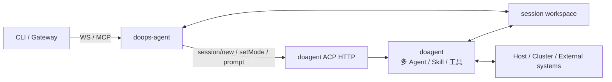

# doops-agent 设计

本文描述边缘 `doops-agent` 的当前职责。CI/CD 的完整 Agent 原生边界见
[`AGENT_NATIVE_CICD.md`](../docs/AGENT_NATIVE_CICD.md)。

## 定位

`doops-agent` 是部署在目标节点或集群中的执行网关和 doagent ACP 适配器。它暴露
WebSocket/MCP 工具、管理工作区和确定性资源边界，并把自然语言或结构化任务交给
doagent 原生 Agent 引擎。

doops-agent 不是 Agent 框架。上下文、规划、多 Agent、Skill 选择和工具调用都由
doagent 提供。



## 两类入口

| 入口 | 用途 | 执行者 |
| :--- | :--- | :--- |
| 确定性工具 | 明确的 shell、文件、工作区、节点信息等原子操作 | doops-agent |
| `doops_agent_prompt` | 需要现场观察、推理、Skill 或多 Agent 协作的任务 | doagent |

两类入口是独立能力，不互相充当失败 fallback。确定性工具失败时返回真实错误；Agent
任务失败时返回 doagent 或工具的真实错误。doops-agent 不把失败命令自动改写成另一条
执行路径。

## doagent 会话适配

doops-agent 通过本地 ACP HTTP 调用 `/usr/local/bin/do-agent`：

1. 首次请求调用 `session/new`，将 cwd 绑定到当前 session 工作区。
2. 每次 prompt 调用 `session/setMode`，避免复用会话时继承旧权限语义。
3. 调用 `session/prompt`，并通过 SSE 转发 Agent 消息和工具进度。
4. 结构化请求只接受一个 JSON 对象作为终态结果。

原生模式映射：

| 请求 | 模式 |
| :--- | :--- |
| 普通 Ask | `auto` |
| CI/CD Skill | `auto` |

## 权限

- doagent 原生模式和运行时配置决定工具权限。
- doops-agent 不调用 `permission/reply`。
- 收到 `permission.updated` 时操作失败并回传权限详情。
- target 授权、workspace 锁和审计由 DoOps 控制面负责，不能交给提示词判断。

## 工作区

- 每个 session 使用独立工作区。
- 文件和同步接口必须校验 session 与路径，禁止目录穿越。
- CI/CD push 完成后写入 `.doops-ready`。
- CI/CD push 在 workspace 锁内写入并验证 `.doops-ready`，结果由 `$doops-cicd`
  Skill 通过真实模块证据判断，不由 Agent 网关伪造。
- 大文件使用 `doops push/pull`；小文本查看使用文件工具。

## Skill 与工具

Skill 由 doagent 原生机制发现和使用。doops-agent 不实现 Registry、关键词匹配、
依赖级联、上下文预算或 Prompt 拼装器。

Skill 定义目标、不变量、授权和证据，不写死固定命令序列。工具提供可验证的原子能力。
doagent 可以根据任务创建多 Agent、组合 Skill 并选择工具；DoOps 只验证安全边界和
最终证据。

## CI/CD

CI/CD 复用普通 Agent-native Ask：

```text
DeploymentTemplate -> doops push -> Ask -> doagent -> $doops-cicd -> DeploymentRun
```

CLI 只负责显式 workflow/target、工作区同步和任务信封。doops-agent 不实现
发布专用 admission、tool registry 或证据注入；Skill 通过现有 DoOps 模块执行并在
session 工作区写入 Gateway 指定的单一 JSON 结构化结果。

## 安全原则

- 不使用 fallback 或静默降级掩盖真实问题。
- 不自动扩大权限，不根据目录名或历史状态猜测 target。
- 不在日志、配置模板或工具参数中暴露凭据。
- 不把文本成功、零退出码或 Agent 自报完成当作外部验收证据。
- 直接工具和 Agent 工具都必须受 target 授权、资源锁、超时和审计约束。

## 主要代码

| 能力 | 文件 |
| :--- | :--- |
| WebSocket/MCP 与 ACP 适配 | `internal/server/handler_ws.go` |
| Gateway 隧道、授权和队列 | `internal/server/tunnel_hub.go` |
| 工作区同步与 commit 绑定 | `internal/server/workspace_upload.go` |
| 请求类型 | `api/mcp.go` |
| Agent 全局提示边界 | `skills/system_prompt.md` |
| CI/CD Skill | `skills/doops-cicd/SKILL.md` |
