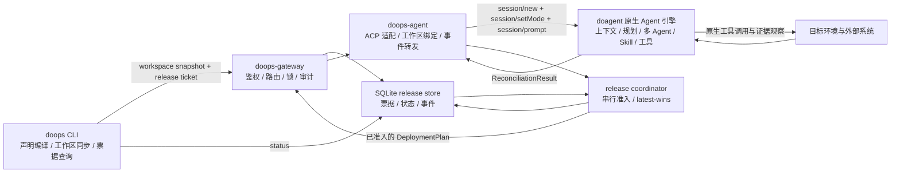

# Agent 原生 CI/CD 架构

本文是 DoOps CI/CD 的权威架构说明。当前只有一个协议版本：
`doops.sh/v2`。后续优化直接演进这一实现，不增加并行版本、兼容入口或隐藏降级路径。

## 核心结论

**DoOps 不实现 Agent 框架。**

DoOps 提供确定性的声明编译、工作区同步、鉴权、路由、锁、审计和结果校验。
doagent 原生 Agent 引擎负责上下文管理、规划、多 Agent 调度、Skill 选择和工具调用。
DoOps 不维护第二套 planner、任务图、子 Agent 拓扑、重试循环或 Skill 组装器。



## 组件职责

| 组件 | 必须负责 | 明确不负责 |
| :--- | :--- | :--- |
| `doops` CLI | 严格解析 `DeploymentTemplate`、生成唯一 `DeploymentPlan`、同步精确工作区、登记和查询发布票据 | 规划执行步骤、选择命令、创建子 Agent、自动修复 |
| `doops-gateway` | 身份鉴权、target 授权、发布票据、串行准入、资源锁、审计、消息路由 | 理解部署语义、执行发布、替 Agent 做决策 |
| `doops-agent` | 将会话绑定到工作区，通过 ACP 调用 doagent，转发事件和结构化结果 | 自建 Agent loop、自动批准权限、编排 Skill 或工具 |
| doagent | 原生上下文、模式、规划、多 Agent、Skill 和工具执行 | 修改 `DeploymentPlan`、绕过授权或伪造证据 |
| Skill | 定义目标、输入边界、不变量、授权边界、证据和输出契约 | 固定命令序列、Agent 拓扑、宿主侧循环、环境猜测 |
| 工具/脚本 | 提供小而确定、可观察、可验证的原子能力 | 充当隐藏的 Agent 框架或通用发布控制器 |

## 唯一执行链路

```text
DeploymentTemplate
  -> DeploymentPlan
  -> workspace push
  -> release ticket
  -> serialized admission
  -> doops_agent_prompt
  -> doagent
  -> ReconciliationResult
  -> durable ticket status
```

1. CLI 以严格 schema 读取模板和环境注册表，未知字段直接失败。
2. CLI 生成带 canonical digest 的 `DeploymentPlan`。
3. source release 要求本地仓库干净，且 `HEAD` 与声明的不可变 revision 一致。
4. CLI 在快照中生成 `.doops/source.json`，再同步到指定 session 并取得精确
   `workspace_commit`。source revision 是发布身份，workspace commit 只是传输身份。
5. Gateway 在同一个 workspace 锁内校验 `.doops-ready` 与请求 commit 一致。
6. CLI 将最小任务信封登记为发布票据，不发送阶段、命令、回滚脚本或重试策略：

```json
{
  "task": "reconcile-deployment-plan",
  "skill": "semantic-deployment",
  "executionMode": "dry-run",
  "deploymentPlan": {
    "apiVersion": "doops.sh/v2",
    "kind": "DeploymentPlan"
  }
}
```

7. Gateway 将票据、原始 `session_id`、用户需求和状态事件持久化。协调器一次只准入
   一张票，不并发执行多个发布。
8. doops-agent 在每次 prompt 前设置 doagent 原生模式，避免复用会话时继承上一次授权状态。
9. doagent 自主选择 Skill、工具和多 Agent 协作方式，最终返回一个 `ReconciliationResult`。
10. doops-agent 等待权威 `turn_finished`，将本轮真实 ACP 工具终态事件按原始
   SSE 顺序哈希为 `executionEvidence`；每条 evidence 用精确工具名和同名终态事件
   的一基序号组成 `toolRef`，bridge 严格解析后注入真实 `toolCallId`、tool digest
   和整轮 trace digest。
11. bridge 校验协议版本、plan digest、source revision、workspace commit、turn、工具 trace、
    状态、逐条工具绑定、证据完整性和计数一致性。协调器只接受校验后的结构化结果，
    再把票据更新为终态。文本成功和未绑定工具调用的 evidence 都不算成功。

## 多会话发布协调

`doops cicd run` 的成功含义是“工作区已同步且发布票据已登记”，不是“部署已完成”。
返回对象中的 `ticket.number` 是该 Gateway 数据库内的查询编号。调用方使用：

```text
doops cicd status <number> --target <gateway-target>
```

查询权威状态、原始会话、用户需求和事件时间线。创建票据即注册持久化回执；原会话可以
由旁支 Agent 按编号查询，不需要让提交发布的会话一直占用同步连接。当前协议的可靠通知
是票据状态和事件日志，不宣称不存在的 webhook 或离线 WebSocket 推送。

状态机只有：

```text
queued -> running -> completed
                  -> failed
queued -> superseded
```

- scope 由 Gateway 根据 `cluster / instance / environment / namespace / application /
  release` 生成，客户端不能自定义。
- 同 scope 只合并仍在 `queued` 的请求，最新票据胜出；正在 `running` 的票据永不抢占。
- 不同会话和不同 scope 共享一个协调器，按票据顺序逐张执行。
- 目标离线时票据保持 `queued`，不会为了越过离线目标而伪造失败。
- `blocked`、`failed` 或无效终态结果直接进入 `failed`，不自动重试，也不切换发布路径。
- Agent 连接中断、执行超时或其他不能证明远端 turn 已终止的传输错误，以
  `outcome=unknown` 失败并使协调器进入 halted；后续票据不再准入，新登记返回
  `503`。必须先人工确认远端状态，再重启协调器。
- Gateway 启动时如果发现先前的 `running` 票据，也以 `outcome=unknown` 恢复为
  `failed` 并保持 halted。不能把进程中断后的实际部署状态猜成成功。
- 协调器停止时会请求取消正在进行的 Agent 调用并停止后续准入。远端 turn 的权威
  取消必须由 doagent `session/cancel` 终态确认；确认能力完成前不能把本地 context
  cancellation 当作远端 mutation 已停止。

## 原生模式

| DoOps 请求 | doagent 原生模式 | 含义 |
| :--- | :--- | :--- |
| 普通 `ask` | `auto` | 由 doagent 根据任务自主规划 |
| CI/CD `dry-run` | `plan` | 只观察和规划，不授权 mutation |
| CI/CD `apply` | `build` | 允许在 `DeploymentPlan` 范围内执行 mutation |

模式映射必须由机器可读的 `operation` 和 `execution_mode` 决定。不能通过自然语言、
全局环境变量或历史会话状态推断。

## 权限边界

- 权限策略属于 doagent 原生模式和运行时配置。
- doops-agent 不调用 `permission/reply`，也不替用户或引擎回答权限请求。
- 收到意外 `permission.updated` 时，当前操作立即失败并返回具体权限信息。
- 不允许使用全局“自动批准所有工具”开关扩大 CI/CD 或普通 Ask 的权限。
- 缺少权限是 `blocked` 事实，不是启用 fallback 或改走手工发布的理由。

## 终态与证据

- `session/prompt` 的同步响应只表示 admission，不能表示任务成功。
- `agent_message` 和 `usage_update` 都是非权威事件；doops-agent 只以
  `turn_finished.status=completed` 接受成功终态。
- `failed`、`cancelled`、`interrupted`、context limit、budget limit 和 needs input
  都必须作为失败返回，不能被更早的文本消息覆盖。
- prompt admission 失败必须立即返回原始 RPC 错误，不能继续等待 SSE 超时。
- doops-agent 对每个 completed/failed 工具事件计算摘要，并生成 turn-level
  `executionEvidence`。
- `converged` 至少需要一个实际完成的观察工具调用。
- 每条 `evidence` 与 `failureEvidence` 都必须提供 `toolRef`。bridge 按原始 SSE
  同名终态事件顺序解析，拒绝缺失、越界、失败、写入/通用执行或其他非观察调用，
  并注入真实 `toolCallId`、匹配的 `toolDigest` 与整轮 `traceDigest`。
- CLI 重新计算 trace，核对本次 push 的 `workspace_commit`，并交叉检查 evidence
  的 `toolCallId`、`toolDigest` 和 trace。整轮存在另一条观察调用不能替代逐条绑定。
- 通用执行工具仍可用于协调动作，但其输出不能作为观察 attestation；验收证据必须
  来自只读或专用观察工具。

## Skill 设计

Skill 应回答以下问题：

1. 输入对象是什么，哪些字段是权威事实。
2. 目标状态和不可变约束是什么。
3. dry run 与 apply 的授权边界是什么。
4. `converged` 需要哪些实际证据。
5. 缺能力、缺权限、验收失败时如何报告。
6. 最终输出 schema 是什么。

Skill 不应回答以下问题：

- 必须按什么命令顺序执行；
- 必须创建几个子 Agent；
- 必须调用哪个具体二进制；
- 必须重试几轮或使用哪种宿主侧 loop；
- 必须使用某一种固定回滚技术；
- 如何根据目录名、域名或历史配置猜测环境。

恢复能力也必须声明化。只有实际发生 mutation、验收失败且目标环境明确提供可逆恢复
能力时，doagent 才能使用该能力并记录实际结果。没有恢复能力时必须如实返回
`blocked` 或 `failed`，不能伪造兼容路径。

## 工具与脚本

脚本需要比普通说明文档更严格，因为它可能直接改变环境：

- 一个脚本只提供一个清晰能力，输入、输出、退出码和副作用必须明确。
- mutation 脚本必须有显式授权，能做 dry run 时必须提供 dry run。
- 尽量幂等；无法幂等时要明确一次性条件和重复执行风险。
- 失败必须返回非零状态和原始原因，不能吞错、伪造成功或静默切换路径。
- 不读取未声明的凭据，不把密钥写入参数、日志、仓库或生成物。
- 不猜测 target、namespace、registry、workload、container 或历史 release。
- 不在脚本里实现规划、Skill 路由、多 Agent 调度、自动修复循环或权限批准。
- 不用一个“大而全”的发布脚本替代 `DeploymentPlan`、doagent 和证据校验。
- 校验脚本必须基于外部可观察事实，不能只检查自己刚写出的状态。

仓库或环境可以把经过审查的脚本作为一个原子工具暴露给 doagent，但是否调用、何时调用
仍由 doagent 根据当前任务、Skill 和实际能力决定。

## 确定性与智能边界

| 确定性宿主逻辑 | Agent 原生逻辑 |
| :--- | :--- |
| schema 校验 | 任务分解 |
| plan digest | 上下文管理 |
| workspace commit 绑定 | 多 Agent 委派 |
| target 授权与锁 | Skill 组合 |
| dry-run/apply 到原生模式映射 | 工具选择和调用 |
| JSON 与证据完整性校验 | 观察、推理和协调 |
| ACP 工具 trace attestation | 根据现场反馈选择下一步 |
| 审计记录 | 根据真实反馈调整计划 |

判断标准很直接：如果逻辑必须对同一输入稳定复现，或涉及授权、身份、锁和验收，它属于
DoOps 确定性边界；如果逻辑依赖现场观察和任务推理，它属于 doagent。

## 禁止模式

- 在 Gateway 中实现 planner、Skill Registry、级联依赖和 Prompt 拼装。
- CLI 用长自然语言提示重复 Skill 的执行策略。
- 复用会话时不重设原生模式。
- doops-agent 自动回复 `permission.updated`。
- Skill 写死工具名称、环境坐标、命令顺序和固定回滚实现。
- 命令失败后自动切换到另一条未声明路径。
- 同时维护多个 CI/CD 协议或多个等价入口。
- 通过文本“部署成功”绕过 `ReconciliationResult` 和证据验证。
- 在 `turn_finished` 前把 `agent_message` 或 `usage_update` 当作成功。
- 接受未绑定 `executionEvidence` 的 Agent 自报 evidence。
- 用缺失、越界、失败、非观察或无关的 `toolRef` 为 evidence 背书。

## 代码位置

| 责任 | 代码 |
| :--- | :--- |
| 模板、计划和 CLI 执行 | `skills/doops-cli/cli/doops/cicd_v2.go`、`cicd_agentic.go` |
| 结果验证 | `skills/doops-cli/cli/doops/cicd_result.go` |
| Agent 请求协议 | `agent/api/mcp.go` |
| ACP 会话、模式和事件适配 | `agent/internal/server/handler_ws.go` |
| 工作区 commit 绑定 | `agent/internal/server/workspace_upload.go` |
| 发布票据与事件 | `agent/internal/server/release_store.go` |
| 串行准入与 Agent 调用 | `agent/internal/server/release_coordinator.go` |
| 发布 HTTP API | `agent/internal/server/release_http.go` |
| CLI 票据登记与查询 | `skills/doops-cli/cli/doops/cicd_release.go` |
| CI/CD Skill | `agent/skills/semantic-deployment/SKILL.md` |
| Agent 全局边界 | `agent/skills/system_prompt.md` |

## 变更验收

修改 CI/CD、Skill、工具或脚本时至少检查：

- 是否仍只有 `doops.sh/v2` 一个协议；
- 是否把新的 Agent 规划逻辑塞进了 CLI、Gateway 或脚本；
- 是否保持 workspace commit、target、授权和结果校验的确定性；
- 是否保持同 scope latest-wins、running 不抢占、全局单 worker 和持久化恢复语义；
- 是否能通过票据编号查到原始 session、用户需求、状态和事件；
- 是否为每次 prompt 设置正确原生模式；
- 是否存在自动权限批准、fallback 或静默降级；
- 是否用实际工具证据验证主要成功和失败路径；
- 行为变化是否同步更新本文和面向用户的 CI/CD 文档。
