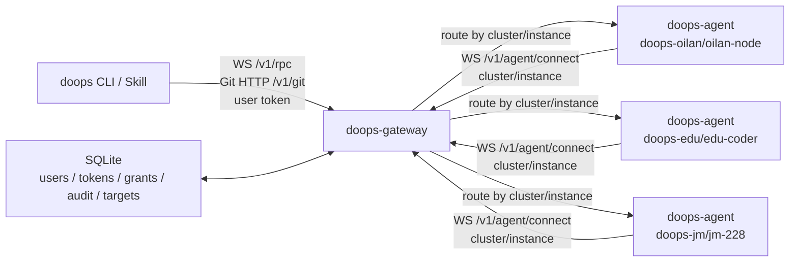

# Doops Gateway Tunnel

`doops-gateway` 是公网控制面。内网 `doops-agent` 不暴露端口，而是主动连到
gateway；`doops` CLI 和 skill 再连接 gateway，通过 `cluster/instance` 选择目标。

## Topology



gateway 是统一公网控制面：

- 用户侧只连接 gateway，不直接暴露内网 agent
- agent 主动长连接注册自己
- gateway 负责鉴权、授权、审计、排队和目标路由

## Managed Gateway Host

当前受管 gateway 主机信息：

- 公网地址：`203.0.113.10`
- SSH 用户：`ubuntu`
- Gateway 服务端口：`42222`
- Gateway URL：`http://203.0.113.10:42222`
- 维护用途：发布和自恢复 `doops-gateway` 控制面，不作为普通 `doops-agent` target 使用。

维护凭据不得写入仓库。需要发布 gateway 时使用：

```bash
bash scripts/deploy-gateway.sh --host 203.0.113.10 --user ubuntu
```

第一版是 SQLite + 单活可靠部署：

- SQLite WAL 数据库：用户、token、权限、审计。
- agent 注册 gateway 不需要 token；注册身份由 `cluster/instance` 决定，访问控制由用户侧 token 和权限决定。
- user token 只能执行授权范围内的 action。
- gateway 转发 doops JSON-RPC 操作流量和 Git HTTP 请求，不做裸 TCP 隧道。
- `push/pull` 在标准 gateway 路径下使用 Git 语义。gateway 对外暴露 `/v1/git/<cluster>/<instance>/<session>.git/...`，再通过目标 agent 已建立的反向 WebSocket 把 Git HTTP 请求透传给 agent 本地 `/git/<session>.git/...`。
- `doops_workspace_*` 是低层兼容工具，允许旧客户端或定制客户端继续工作；CLI、发布脚本和 skill 的标准路径必须是 Git HTTP 的 `push/pull`。看到 `512KB` 分块日志时，应优先检查调用方是否绕过了当前 CLI。
- 密码登录签发短期 user token，默认 24 小时过期；过期 token 会在登录时顺手清理。
- token 校验通过 token id 定位单行哈希，避免多人多 token 时全表 bcrypt 扫描。
- 同一 `cluster/instance` 默认串行执行，并允许最多 8 个操作排队等待 2 分钟；队列满或超时会返回明确错误。

## Endpoints

- `GET /health`
- `GET /v1/targets`
- `WS /v1/agent/connect?cluster=<cluster>&instance=<instance>`
- `WS /v1/rpc?cluster=<cluster>&instance=<instance>`
- `GET/POST /v1/git/<cluster>/<instance>/<session>.git/...`

旧 gateway 草稿端点和共享 token 模式已经废弃。

## Start Gateway

用户、user token 和授权由管理员维护。agent 注册 gateway 不需要预签发 token。产品和 skill 的日常入口是 `doops`；gateway 内部维护命令不作为业务用户操作手册暴露。

gateway 是独立发布包，不登记为 doops target，也不通过任何 target 发布自己。

标准发布入口：

```bash
bash scripts/deploy-gateway.sh --host <gateway-host> --user <ssh-user>
```

脚本只走 SSH/SCP，并在宿主机真实 root 下校验 DB、备份二进制、替换、重启和
校验 `/proc/<pid>/exe` hash。不要用 `doops exec/push/write` 或 base64 分片部署
`doops-gateway`。

手工构建入口在仓库一级目录 `gateway/`：

```bash
bash scripts/build-gateway.sh
```

```bash
./bin/doops-gateway serve -db /var/lib/doops-gateway/gateway.db -port 42222 \
  -login-token-ttl 24h \
  -operation-timeout 30m \
  -max-concurrent-operations 64 \
  -max-concurrent-per-user 8 \
  -max-queued-per-target 8 \
  -target-queue-timeout 2m
```

Token 只打印一次，数据库里只保存哈希。

如果用户使用密码登录，gateway 会通过 `POST /v1/auth/login` 签发一个 user token；CLI 只缓存 token，不保存用户密码。

## User Management

维护用户、密码、token、授权和审计属于 gateway 管理员能力。业务用户和自动化脚本只使用 `doops` 操作 target；不要在业务文档、skill 或日常流程里直接暴露 gateway 内部维护命令。

管理员签发用户 token 使用 CLI，而不是 SSH 到 gateway 主机上手工操作数据库：

```bash
doops admin token create \
  --target <gateway-target> \
  --user <username> \
  --name <label> \
  --expires 720h
```

`--target` 用于选择本机配置里的 gateway 地址和管理员 token；也可以显式传
`--gateway` 和 `--token`。如需把新 token 写入本机缓存，必须显式加
`--save-as <configured-target>`。

管理员能力应覆盖：

- 创建/禁用用户，设置或重置密码。
- 创建、吊销、轮换 user token。
- 普通 user token 默认拥有所有 target 操作能力。需要隔离时，再按 `cluster/instance/action` 显式收窄；管理员能力仍使用显式 `admin` 权限。
- 按 `user_id`、`token_id`、`cluster`、`instance`、`action`、`session`、`status` 查询审计。
- 按保留周期清理过期审计，清理前保留可追溯导出。

说明：

- `401 Unauthorized`：token 无效、过期或未登录，属于认证失败
- `403 Forbidden`：token 有效，但当前用户被显式收窄后缺少目标 `cluster/instance/action` 权限，或缺少 gateway 管理员 `admin` 权限。
- 新 target 接入后如果 `exec/ask` 直接 403，优先检查 gateway 是否仍在跑旧版本，或该用户是否被显式收窄到其他 scope。

## Multi-User Behavior

多人同时使用时，gateway 的原则是“全局限流、用户限流、目标串行”：

- 不同 target 可以并发执行。
- 同一 target 上的 `exec/ask/write/push/pull/clean/check/agent:upgrade` 会串行进入 agent，避免多个用户同时改同一个环境。
- `ask` 属于慢任务，也走同一队列；如果一个用户正在 ask，后续用户会排队，超过 `-target-queue-timeout` 返回 `target queue timeout`。
- `-max-concurrent-per-user` 控制单个 gateway 用户最多占用多少个运行中操作槽；超过时返回 `user operation limit exceeded`。
- `-operation-timeout` 控制单个转发操作的最长运行时间，超时会释放 gateway 操作槽。
- `-max-queued-per-target` 控制每个 target 的等待队列长度；设置为负数可关闭排队，恢复旧的立即 `target busy` 行为。
- `-login-token-ttl` 控制密码登录生成 token 的有效期；长期自动化应使用管理员发放的可轮换服务 token。

管理员可以查看和回收正在占用 gateway 操作槽的请求：

```bash
doops admin operations list --target <gateway-target>
doops admin operations cancel --target <gateway-target> --id <operation-id>
```

`cancel` 会取消 gateway 转发并释放操作槽；升级后的 agent 收到 cancel 信号后，会对
`doops_shell`、`doops_docker`、`doops_node_info` 这类本地命令按进程组终止。`ask`
依赖 doagent 异步执行，当前 cancel 只中断 doops 等待链路，不能保证 doagent 内部
已经派生的任务全部终止；遇到这类场景仍要按 session 或进程维度做后续清理。

`ask` 链路是 `CLI -> gateway -> doops-agent -> doagent ACP HTTP`。如果 `exec` 成功而 `ask` 失败，优先检查目标 agent 容器内：

```bash
ps -ef | grep 'do-agent acp-http'
grep -n 'apiKey\|baseURL\|model' /root/.agent/settings.json
```

`/root/.agent/settings.json` 必须有非空 `provider.openai.options.apiKey`，或启动容器时注入 `OPENAI_API_KEY` 让 entrypoint 生成配置；否则 doagent 会拒绝启动，`ask` 会失败。

## Start Private Agent

优先用容器或 K8s 部署。裸二进制 `/usr/local/bin/doops-agent -port ...` 只适合临时自举/排障；没有 `-gateway-url` 的进程不会自动出现在 gateway。

### 容器或 K8s 方式

```bash
docker run -d --name doops-agent \
  --privileged --pid=host --network=host \
  --restart=unless-stopped \
  -v /var/run/docker.sock:/var/run/docker.sock \
  -v /root/.kube:/root/.kube:ro \
  -v /etc/kubernetes:/etc/kubernetes:ro \
  docker.cnb.cool/l8ai/ai/doops.sh:v1.1 \
  -port 42222 \
  -gateway-url https://gateway.example.com \
  -cluster prod \
  -instance master-1 \
```

```bash
doops-agent \
  -gateway-url https://gateway.example.com \
  -cluster prod \
  -instance master-1 \
```

如果省略 `-instance`，agent 使用主机名。agent 断线后会自动重连；gateway 不会重放已中断的高危操作。

### 裸二进制自举/排障方式

如果当前机器只有 `/usr/local/bin/doops-agent -port 42222 ...` 这样的裸进程，而没有 Pod/容器，就说明还不是容器化安装。此时：

- 标准做法是重新用 `-gateway-url ... -cluster ... -instance ...` 启动 agent，或迁移为容器/K8s 安装
- 遗留直连只能用于确认本机进程是否还活着，不能作为标准 target 配置

## Configure CLI

```json
{
  "servers": [
    {
      "name": "prod-master",
      "aliases": ["prod", "master"],
      "gateway": "https://gateway.example.com",
      "cluster": "prod",
      "instance": "master-1",
      "token": "<USER_TOKEN>",
      "use": "prod cluster master via gateway"
    }
  ]
}
```

或者：

```bash
doops add \
  --name prod-master \
  --aliases prod,master \
  --gateway https://gateway.example.com \
  --cluster prod \
  --instance master-1 \
  --token "$DOOPS_GATEWAY_USER_TOKEN"
```

## Use

```bash
doops targets --target prod-master
doops -session smoke exec --target prod --cmd 'hostname'
doops -session smoke exec --target prod-master --cmd 'hostname && kubectl get nodes'
doops -session smoke ask --target prod-master --msg '只读巡检集群节点状态'
doops -session build push --target prod-master --src .
```

## Actions

授权 action：

- `exec`
- `ask`
- `read`
- `write`
- `push`
- `pull`
- `info`
- `check`
- `clean`
- `agent:upgrade`
- `targets:list`
- `admin`

普通 user token 默认拥有上述 target 操作能力；旧库中只授予 `targets:list` 的 scope 也按全功能 target access 兼容，避免“能看到但不能操作”。需要最小权限隔离时，再显式授予较小 action 集。
`admin` 只用于 gateway 管理，不随默认 target 权限下发。

## Gateway Broadcast Upgrade

gateway 可以通过在线长连接对一批 agent 下发升级操作。第一版支持：

- K8s/DaemonSet：agent 执行 `kubectl set image` 并等待 `rollout status`。
- Docker/nerdctl 容器：agent 拉取新镜像并返回明确状态；自动替换容器需要由 supervisor/编排层接管，避免 agent 在执行中杀掉自己。
- 裸二进制：明确返回 unsupported，不做镜像升级。

示例：

```bash
doops -session upgrade_20260511 upgrade \
  --target prod-master \
  --cluster '*' \
  --instance '*' \
  --image docker.cnb.cool/l8ai/ai/doops.sh:v1.1 \
  --mode k8s \
  --namespace doops-system \
  --workload daemonset/doops-agent \
  --container doops-agent
```

先 dry-run：

```bash
doops -session upgrade_20260511 upgrade \
  --target prod-master \
  --cluster doops-jm \
  --image docker.cnb.cool/l8ai/ai/doops.sh:v1.1 \
  --mode k8s \
  --dry-run
```

## Reliability Notes

- SQLite 数据库建议放持久卷：`/var/lib/doops-gateway/gateway.db`。
- 单活部署即可，K8s 使用单副本 Deployment 或 systemd 托管。
- 源码入口是仓库一级目录 `gateway/`；`agent/cmd/gateway` 仅保留为兼容 wrapper。
- gateway 默认监听 `42222`；公网部署时云安全组/防火墙也必须放行 TCP 42222。
- gateway 按 `cluster/instance` 和资源键隔离操作；不同 session/workspace 可并发，同一资源互斥。
- `/v1/targets` 中 `busy=true` 只表示 target-wide 阻塞；普通 session 运行显示为 `status=active`、`busy=false`，并在 `resources` 中标出锁住的资源。
- gateway 还维护全局/用户级并发闸门；默认全局 64 个并发操作、单用户 8 个并发操作。
- gateway 会主动对 agent WebSocket 发 ping，agent pong 后刷新租约和 SQLite `last_seen`。
- agent 上下线状态写入 SQLite，在线目标由内存连接表提供，断线时立即标记 offline。
- agent 重连替换旧连接时，旧连接的关闭不会把新连接错误标记为 offline。
- 审计记录包含 user、token、target、action、session、命令摘要、状态、错误和输出尾部；输出尾部使用有界缓冲，默认只保留 8 KiB 尾部摘要。
- gateway 只转发操作流量和 Git HTTP 流量，不保存仓库快照。大文件、可恢复续传、跨用户长期共享 artifact 建议新增独立 artifact store，不把 gateway 扩展成对象存储。

## 2026-05-11 Production Smoke

这段 smoke 使用的是受控实验 gateway。doops 支持 `http` / `https` gateway；公网生产环境建议改用 `https` / `wss` gateway，但 CLI 和 agent 不会因为 gateway 是 HTTP 而拒绝连接。

公网 gateway 部署在 `203.0.113.10:42222`，当前已接入：

- `doops-114/vm-114`
- `doops-jm/jm-228`

已验证：

- `doops targets --gateway http://203.0.113.10:42222`
- 89/114/JM 的 `exec`
- 89/114/JM 的 `write` + `read`
- 89/114/JM 的 gateway `push` 到 `/root/ws/$SESSION`，并校验 `.doops-ready` 和文件 sha256；传输路径为 `/v1/git/<cluster>/<instance>/<session>.git` 的 Git HTTP 反向隧道
- 未授权 token 执行 `write` 返回 `forbidden` 并写入 audit
- 超过 90 秒后重复 `targets` 和 `exec`，确认 heartbeat 不误踢 agent

JM 第三实例已通过 89 内网路径接入，目标标识为 `doops-jm/jm-228`。89/114/JM 的运行容器命名已统一为标准 `doops-agent`。

## Current Managed Targets

当前文档维护口径：

- `doops-oilan / oilan-node` -> `198.51.100.24`，oilan 集群，标准 k3s 部署
- `doops-edu / edu-coder` -> `198.51.100.23`，edu-coder 集群
- `doops-jm / jm-228` -> JM 集群
- `doops-zheyin / node-239` -> 浙音集群
- `doops-114 / vm-114` -> 114 集群
- `doops-235 / hdu-235` -> 杭电节点

注意：

- `oilan` 和 `edu-coder` 是两套不同集群，不能混写成同一个 cluster
- 历史上的 `doops-89/master-node` 是旧链路名，不再作为当前标准纳管名称

## Cloud Firewall Note

如果 gateway 进程在机器本机 `127.0.0.1:42222` 健康，但从公网访问 `http://<gateway-ip>:42222/health`
超时，通常是云安全组没有放行 TCP 42222。系统防火墙放行不能替代云安全组放行。

在安全组尚未开放前，可以临时让内网 agent 经 SSH local forward 连接到 gateway 本机端口：

```bash
ssh -N \
  -L 127.0.0.1:32223:localhost:42222 \
  ubuntu@<gateway-ip>

doops-agent \
  -gateway-url http://127.0.0.1:32223 \
  -cluster prod \
  -instance master-1 \
```

这只是内网 agent 到 gateway 的临时通路；CLI/skill 作为公网入口使用时，仍应开放 gateway 公网 TCP 42222。
