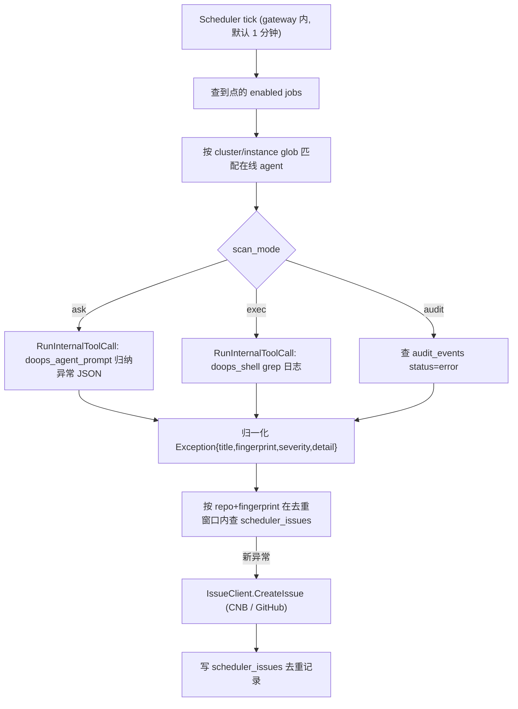

# Doops 定时巡检与自动提 Issue

gateway 内置一个定时调度器，可以按周期对匹配的在线实例做**只读巡检**，把发现的
运行时异常归一化后自动到 git 平台（CNB / GitHub）提 issue，并按 fingerprint 去重，
避免同一问题反复刷屏。

## 架构



调度器运行在 gateway 进程内，复用 gateway 的在线连接表与目标串行/排队语义
（`RunInternalToolCall`），因此巡检不会和用户操作互相踩踏。

## 扫描模式 scan_mode

- `ask`（默认）：用 doagent（LLM）只读巡检本节点，要求其输出结构化 JSON 异常列表。
  最贴近 doops 的差异化能力，能归纳 CrashLoop / OOM / panic / 堆栈等语义异常。
  可用 `--instruction` 覆盖默认提示词。
- `exec`：在节点上跑确定性 shell（默认 grep kubectl/docker 异常状态），逐行作为异常。
  可用 `--command` 覆盖。适合不依赖 LLM、可预测的关键字巡检。
- `audit`：直接查 gateway 审计库里窗口内 `status=error` 的操作，无需 agent 在线。

## 去重

去重键为 `sha1(jobID + cluster + instance + fingerprint + title)`，在
`--dedup` 窗口（默认 24h）内同一指纹只提一次 issue。提交失败也会记录为 `failed`，
避免在窗口内反复打爆平台。

## Git 凭据

git token 不入库、不写仓库。job 里只保存一个**环境变量名**（`--token-env`），
gateway 进程在提 issue 时从自身环境变量读取，例如：

```bash
# gateway 主机 / 容器启动环境
export CNB_TOKEN=...        # 或 GITHUB_TOKEN=...
./bin/doops-gateway serve -db /var/lib/doops-gateway/gateway.db -port 42222
```

- CNB：`POST {api_base|https://api.cnb.cool}/{repo}/-/issues`，issue 链接
  `https://cnb.cool/{repo}/-/issues/{number}`
- GitHub：`POST {api_base|https://api.github.com}/repos/{owner}/{repo}/issues`

## 管理（需要 gateway `admin` 权限）

通过 `doops admin jobs` 子命令操作，鉴权与 `doops admin token/operations` 一致：

```bash
# 列出任务
doops admin jobs list --target <gateway-target>

# 新建一个每小时对 doops-jm 集群做 ask 巡检并提到 CNB 的任务
doops admin jobs add --target <gateway-target> \
  --name jm-runtime-scan \
  --cluster-glob 'doops-jm' --instance-glob '*' \
  --scan-mode ask \
  --interval 1h --dedup 24h \
  --platform cnb --repo l8ai/ai/doops.sh \
  --labels runtime,auto \
  --token-env CNB_TOKEN

# 立即跑一次（不等下一个 tick）
doops admin jobs run --target <gateway-target> --id <job-id>

# 启用/停用 / 删除
doops admin jobs enable  --target <gateway-target> --id <job-id>
doops admin jobs disable --target <gateway-target> --id <job-id>
doops admin jobs rm      --target <gateway-target> --id <job-id>

# 查看某任务已提交的 issue 去重记录
doops admin jobs issues --target <gateway-target> --id <job-id>
```

exec 模式示例（自定义 grep 命令）：

```bash
doops admin jobs add --target <gateway-target> \
  --name k8s-crash-scan --scan-mode exec \
  --command "sh -c 'kubectl get pods -A | grep -Ei \"crashloop|oomkill\"'" \
  --platform github --repo your-org/ops-alerts --token-env GITHUB_TOKEN
```

## HTTP 端点（CLI 之下）

- `GET /v1/admin/jobs`：列表
- `POST /v1/admin/jobs`：创建（JSON body）
- `DELETE /v1/admin/jobs?id=`：删除
- `POST /v1/admin/jobs/run?id=`：立即执行
- `POST /v1/admin/jobs/run?id=&enabled=true|false`：启停
- `GET /v1/admin/jobs/issues?id=&limit=`：去重记录

均要求 `Authorization: Bearer <user-token>` 且该用户具备 `admin` 权限。

## gateway 启动开关

```bash
./bin/doops-gateway serve ... -scheduler-tick 1m   # 默认 1m；设为 0 关闭调度器
```
