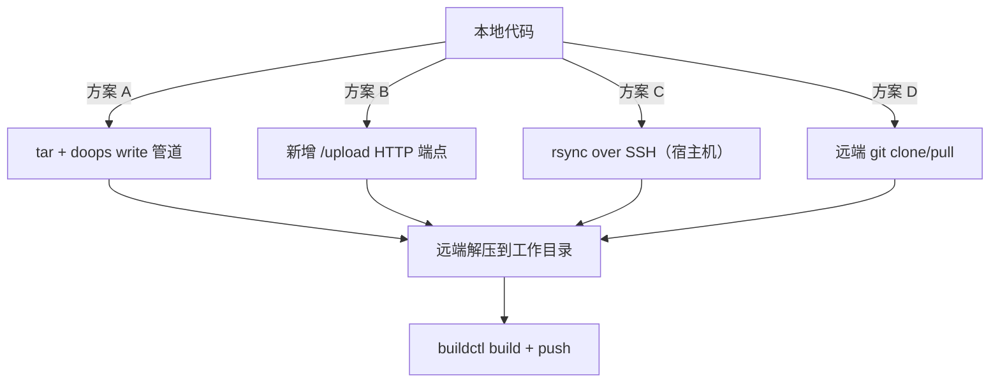
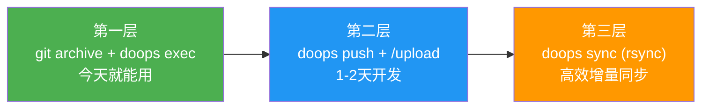

# Agent-MCP 代码同步方案分析

## 核心问题

用户希望在 agent 远端环境中进行代码构建（buildctl build → push → K8s 部署），需要解决两个关键问题：

1. **代码如何到达 agent 工作目录**
2. **代码变更后如何高效增量同步**

---

## 现有能力盘点

| 能力 | 工具/方式 | 限制 |
|:---|:---|:---|
| 单文件写入 | `doops_file_write` (heredoc) | 仅文本、单文件、不适合大量源码 |
| 小文本查看 | `doops_file_read` | 仅配置、脚本、短日志等小文本；不用于下载大文件/二进制 |
| 管道写入 | `doops write --path xxx` | stdin 管道、二进制可能有编码问题 |
| Shell 执行 | `doops_shell` / `doops exec` | 可执行 tar/scp 但需要手动编排 |
| AI 构建 | `doops_agent_prompt` + image-build Skill | Skill 已描述 `git archive + SCP` 策略，但实际没有原生集成 |

> [!IMPORTANT]
> **核心差距**：没有原生的批量文件传输和增量同步工具。目前只能逐个文件写入，或者通过 shell 命令手动编排 tar/scp。

---

## 方案对比



### 方案 A：tar + 现有管道（零改动）

```bash
# 本地打包
tar czf /tmp/src.tar.gz --exclude=.git --exclude=node_modules .

# 传到远端
cat /tmp/src.tar.gz | doops write --target node89 --path /tmp/src.tar.gz

# 远端解压
doops exec --target node89 --cmd "mkdir -p /opt/ws/myproj && tar xzf /tmp/src.tar.gz -C /opt/ws/myproj"
```

| 维度 | 评价 |
|:---|:---|
| 改动量 | ⭐⭐⭐ 零改动 |
| 可靠性 | ⚠️ 二进制管道可能有编码问题 |
| 效率 | ❌ 全量传输 |
| 适用 | 小项目 (<1MB) 临时用 |

---

### 方案 B：新增 `doops push` + `/upload` 端点（推荐短期方案）

**CLI 侧**新增 `doops push` 命令，**Agent-MCP 侧**新增 HTTP 上传端点。

```bash
# 一行搞定：本地打包 + HTTP 上传 + 远端解压
doops push --target node89 --src ./myproject --dest /opt/ws/myproj
```

内部流程：
1. 本地 `tar czf` 打包（自动排除 `.git`/`node_modules`）
2. HTTP `POST /upload` multipart 上传到 agent
3. 远端解压到 `--dest` 路径

| 维度 | 评价 |
|:---|:---|
| 改动量 | 🔧 CLI 新增一个命令 + agent 新增一个 HTTP 端点 |
| 可靠性 | ⭐⭐⭐ HTTP multipart 传输成熟可靠 |
| 效率 | ⚠️ 仍然全量（但 tar.gz 压缩后通常很小） |
| 适用 | 多数项目，Go 项目通常 < 500KB 压缩包 |

---

### 方案 C：rsync over SSH（推荐中期方案 ⭐）

直接利用宿主机 SSH，不改 agent 代码。

```bash
doops sync --target node89 --src . --dest /opt/ws/myproj

# 内部等效于：
rsync -avz --delete --exclude=.git --exclude=node_modules \
  -e "ssh -p 1022" ./ iict@198.51.100.24:/opt/ws/myproj/
```

| 维度 | 评价 |
|:---|:---|
| 改动量 | 🔧 CLI 新增 sync 命令（调用本地 rsync） |
| 可靠性 | ⭐⭐⭐ rsync 是业界标准 |
| 效率 | ⭐⭐⭐ 天然增量、压缩、断点续传 |
| 前提 | 需要宿主机 SSH 凭证（已在 config.json 中维护） |

> [!TIP]
> agent 以 `hostNetwork: true` + `privileged: true` 运行，SSH 端口（22）天然可达。历史方案曾复用本地 config 中的 SSH 凭证；当前 doops CLI 默认配置源已收敛到 `~/.agent/skills/doops/config.json`，SSH 只作为安装或自恢复备用路径。

---

### 方案 D：远端 Git Clone/Pull

```bash
# 远端直接从 Git 仓库拉取代码
doops exec --target node89 --cmd "cd /opt/ws && git clone https://github.com/xxx/myproj.git"
# 后续只需 git pull
doops exec --target node89 --cmd "cd /opt/ws/myproj && git pull"
```

| 维度 | 评价 |
|:---|:---|
| 改动量 | ⭐⭐⭐ 零改动 |
| 可靠性 | ⭐⭐⭐ Git 可靠 |
| 效率 | ⭐⭐ 增量（但首次 clone 可能慢） |
| 前提 | 需要 Git 仓库（私有仓库需认证） |
| 局限 | 未提交的代码无法同步 |

---

## 推荐策略：分层递进



### 第一层（立即可用）：git archive 组合命令

无需任何代码改动，用现有工具编排：

```bash
# 1. 本地打包（自动排除 .git）
git archive --format=tar.gz HEAD -o /tmp/myproj.tar.gz

# 2. SCP 直接传到宿主机（利用已知 SSH 凭证）
scp -P 1022 /tmp/myproj.tar.gz iict@198.51.100.24:/tmp/

# 3. 远端解压
doops exec --target node89 --cmd \
  "mkdir -p /opt/ws/myproj && tar xzf /tmp/myproj.tar.gz -C /opt/ws/myproj"

# 4. 远端构建
doops exec --target node89 --cmd \
  "cd /opt/ws/myproj && buildctl --addr unix:///run/buildkit/buildkitd.sock build \
     --progress=plain \
     --frontend dockerfile.v0 \
     --local context=. \
     --local dockerfile=. \
     --opt filename=Dockerfile \
     --output type=image,name=registry.example.com/oilan-system/myapp:latest,push=true,registry.insecure=true"
```

### 第二层（短期开发）：doops push

在 CLI 中封装上述流程为一条命令，用户体验极大提升。

### 第三层（中期优化）：doops sync

基于 rsync 的增量同步，适合频繁迭代开发。

---

## 构建工作目录管理

> [!NOTE]
> 建议使用持久化工作目录而非临时目录，以保留 Docker build cache。

| 项目 | 路径 | 说明 |
|:---|:---|:---|
| 工作区根目录 | `/opt/doops/workspaces/` | 所有项目的父目录 |
| 项目工作区 | `/opt/doops/workspaces/{project}/` | 代码解压/同步目标 |
| 构建日志 | `/tmp/doops-build-{project}.log` | 构建过程日志 |

```bash
/opt/doops/workspaces/
├── exam-lab-api/          # 项目源码
│   ├── Dockerfile
│   ├── main.go
│   └── ...
├── go-judge/              # 另一个项目
│   └── ...
└── .sync-state.json       # 同步状态追踪（commit hash）
```

---

## 关键决策点

需要你确认的几个问题：

1. **传输通道优先级**：优先走 MCP HTTP 通道（方案 B），还是直接利用宿主机 SSH（方案 C）？
   - MCP 更"纯正"但需要开发新端点
   - SSH (rsync) 最高效但需要本地安装 rsync（macOS 自带）

2. **是否需要支持未提交代码同步**？
   - 如果只同步已提交代码，Git-based 方案最简单
   - 如果需要同步工作区的脏文件，必须用 tar/rsync

3. **是否需要将 `push/sync` 作为 MCP 工具暴露**，还是只作为 CLI 命令？
   - AI Agent 场景下如果需要自动同步代码，应暴露为 MCP 工具
   - 如果只是人工触发，CLI 命令即可
