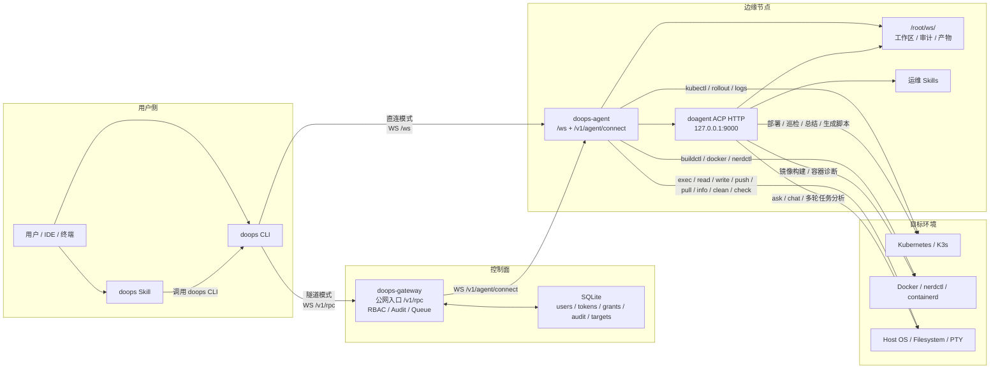

# doops.sh — 分布式 AI 运维执行系统

`doops.sh` 是面向远端运维节点的执行与智能分析入口。系统把确定性命令和自然语言任务拆成两条路径：明确命令走 `exec` 快路径，复杂意图走 `ask` 慢路径，由边缘节点上的 doagent 结合 Skills 自主分析、执行和回传结果。

## 核心调用链路



主链路分成两种连接模式和两种执行路径：

- 连接模式：CLI 可以直连 `doops-agent`，也可以先连 `doops-gateway` 再路由到内网 agent。
- 执行路径：确定性命令走 `exec/read/write/push/pull/info/check/clean`，复杂意图走 `ask`，由 `doagent` 结合 Skills 和工作区上下文处理。

## 组件分工

| 层级 | 组件 | 角色 |
| :--- | :--- | :--- |
| 客户端 | `doops` CLI | 读取目标配置，建立 WebSocket，发起 exec/ask/push/pull/read/write |
| Skill | `.agent/skills/doops/SKILL.md` | 告诉上位 Agent 如何使用 doops，不直接保存凭据 |
| 网关 | `/app/doops-agent` | 暴露 `/ws`、鉴权、PTY 会话、Git HTTP、文件读写 |
| AI 内核 | `/usr/local/bin/do-agent` | 通过 ACP HTTP 处理自然语言任务 |
| 配置 | `/root/.agent/settings.json` | doagent provider/model 配置，密钥由 Secret 或本地文件注入 |

## 协议与鉴权

- CLI 到网关统一使用 WebSocket：`ws://<node-ip>:42222/ws`。
- WebSocket 握手使用 `X-Doops-Key` 或 `Authorization: Bearer <token>`。
- 客户端配置字段统一为 `token`。
- 模型网关统一使用 `https://api.example.com` 或 `https://api.example.com/v1`。

## 快路径与慢路径

| 路径 | 入口 | 用途 | 依赖 |
| :--- | :--- | :--- | :--- |
| 快路径 | `doops exec` / `doops_shell` | 明确命令、CI 检查、确定性发布 | doops-agent 网关 |
| 慢路径 | `doops ask` / `doops_agent_prompt` | 复杂排障、自动探索、总结报告 | doops-agent + doagent ACP HTTP + settings.json |

快路径必须在 doagent 不可用时仍能工作；慢路径失败时应返回清晰错误，例如 doagent ACP 未启动、模型配置缺失或 API 网关不可达。

## 部署形态

默认镜像为：

```text
docker.cnb.cool/l8ai/ai/doops.sh:v1.1
```

发布同时维护基础镜像：

```text
docker.cnb.cool/l8ai/ai/doops.sh/base:v1
```

`doops.sh/base` 包含 sandbox、doagent、BuildKit 和系统工具；`doops.sh` 只叠加 doops-agent、skills、docs 和 entrypoint。K8s 日常只滚动 `doops.sh`，基础镜像只在运行时能力变化时升级。

镜像内关键路径：

- `/app/doops-agent`：Go Gateway
- `/usr/local/bin/do-agent`：doagent AI 内核
- `/app/skills`：doops 运维 Skills
- `/root/ws/<session>`：远端工作区
- `/root/.agent/settings.json`：doagent 模型配置

## Skill 编写约束

业务项目可以在 `.agent/skills/<name>/SKILL.md` 中沉淀 SOP。Skill 应描述目标、检查点和允许的命令边界；远端代码同步统一通过 `doops push`，确定性操作优先通过 `doops exec`，复杂排障才交给 `doops ask`。

## 安全边界

- 日常连接只使用 agent token，不依赖 SSH。
- SSH 仅用于首次自举或 agent 完全不可用时的自恢复。
- 生产配置中的 API key 不写入 ConfigMap 模板，应通过 Secret 或节点本地 `settings.json` 注入。
- 发布前必须验证 `/app/doops-agent` 和 `/usr/local/bin/do-agent` 都能在最终镜像内启动。
