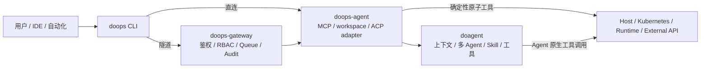

# doops.sh 分布式 Agent 运维系统

CI/CD 的权威职责边界见
[`AGENT_NATIVE_CICD.md`](../AGENT_NATIVE_CICD.md)。

`doops.sh` 把确定性控制面与 Agent 原生执行面分开：CLI、Gateway 和边缘适配器负责
可重复验证的协议、安全和工作区边界；doagent 负责上下文、规划、多 Agent、Skill 和
工具执行。

## 架构

```mermaid
flowchart LR
    USER["用户 / IDE / 自动化"]
    CLI["doops CLI"]
    GW["doops-gateway\n鉴权 / RBAC / Queue / Audit"]
    EDGE["doops-agent\nMCP / workspace / ACP adapter"]
    ENGINE["doagent\n上下文 / 多 Agent / Skill / 工具"]
    TARGET["Host / Kubernetes / Runtime / External API"]

    USER --> CLI
    CLI -->|"直连"| EDGE
    CLI -->|"隧道"| GW
    GW --> EDGE
    EDGE --> ENGINE
    EDGE -->|"确定性原子工具"| TARGET
    ENGINE -->|"Agent 原生工具调用"| TARGET
```

## 分层职责

| 层 | 负责 |
| :--- | :--- |
| CLI | 配置读取、协议编译、工作区同步、结构化结果验证 |
| Gateway | 用户和 target 鉴权、队列、并发限制、资源锁、审计、路由 |
| doops-agent | MCP 工具、session 工作区、ACP 会话和事件适配 |
| doagent | 上下文、规划、多 Agent 委派、Skill 组合、工具选择 |
| Skill | 领域目标、不变量、授权、证据和输出契约 |
| 工具 | 小而确定的执行或观察能力 |

DoOps 不在 Gateway 或脚本中复制 doagent 的 Agent 引擎。

## 执行路径

| 路径 | 入口 | 适用任务 |
| :--- | :--- | :--- |
| 确定性工具 | `exec/read/write/push/pull/info` | 调用方已经知道准确原子操作 |
| Agent 任务 | `ask` / `doops_agent_prompt` | 需要观察、推理、Skill 或多 Agent 协作 |

这两条路径没有自动 fallback。失败必须保留原路径的真实错误，不能静默改写成另一种
执行方式。

## Agent 原生约束

- doops-agent 只通过 ACP 创建会话、设置模式、发送 prompt 和转发事件。
- 每个 prompt 都显式设置 `auto`、`plan` 或 `build` 模式。
- doops-agent 不自动回复 `permission.updated`。
- Skill 选择和多 Agent 调度由 doagent 完成。
- system prompt 和 Skill 不写死环境命令、target 坐标或固定回滚实现。
- CI/CD 只使用 `doops.sh/v2` 的 `DeploymentTemplate -> doops push -> Ask ->
  doops-cicd -> DeploymentRun` Agent-native 链路。

## 工作区与状态

- session 工作区是 Agent 和确定性工具共享的任务上下文。
- Git 工作区同步必须绑定精确 commit。
- CI/CD 在锁内校验 `.doops-ready`，防止并发 push 替换待发布代码。
- 密钥通过 Secret 或节点本地设置注入，不进入 Skill、计划、日志和仓库。

## Skill 和脚本

Skill 描述“要达到什么状态、哪些事实不能改变、什么证据算完成”，不描述固定命令
序列。doagent 可以组合多个 Skill 和工具，也可以委派多个 Agent。

脚本仅用于经过审查的原子能力或确定性校验。脚本必须显式输入、严格失败、可观察，
不得承担规划、Skill 路由、自动修复、权限批准或完整发布控制。

## 部署形态

边缘镜像包含：

- `/app/doops-agent`：Go 网关与 ACP 适配器；
- `/usr/local/bin/do-agent`：doagent 原生 Agent 引擎；
- `/app/skills`：运行时安装的 Skills；
- `/root/ws/<session>`：会话工作区；
- `/root/.agent/settings.json`：模型和 provider 配置。

发布本身遵循 GitOps 和 Semantic CI/CD：配置进入仓库，目标由环境注册表解析，最终
状态由外部证据验证。
