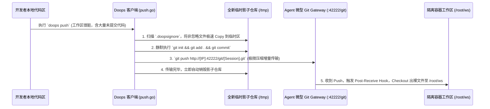

# Doops 无感增量隔离同步引擎设计方案 (Ephemeral Git Sync)

> **✅ 状态：已于 2026-03 落地实施。此文档作为底层架构回顾与历史设计记录保留。**
## 1. 背景与目标
在目前的 `doops` 架构中，客户端通过 `rsync + ssh` 将本地代码推送至远端物理机的 `~/doops-ws`。
此方案暴露了以下不可接受的致命问题：
1. **宿主机穿透风险**：容器化服务向宿主机物理磁盘写文件，违背安全隔离原则。
2. **多端口依赖**：既需要 `42222`（Agent指令）又需要 `1022` (SSH 通道)，破坏了网关收口原则。
3. **环境脆弱性**：强依赖宿主机装有 `sshpass` 与 `rsync` 守护进程。

**核心目标：**
在**完全废弃宿主机挂载和 SSH 端口通信**的前提下，仅利用 `42222` 端口完成大体积工作区的**秒级极速增量传输**。不仅如此，整个底层的版本控制协议（Git Diff）对用户必须是**完全透明无感**的，绝对不污染/干扰用户本地真实工作区的 `.git` 库或提交记录。

---

## 2. 宏观架构设计：临时空域镜像机制 (Ephemeral Repo Buffer)
本方案抛弃对全量 HTTP Tar 包的暴力传输，选择给 doops 插上内置的 Git 极速差分翅膀，同时利用独特的**本地沙盒隔离映射**和**探针级挂钩解包**来屏蔽原生 Git 对用户操作流的入侵。

### 架构拓扑

---

## 3. 详细改造内容

### 3.1 客户端改造 (`doops push` 命令)
核心源码文件：`platform-tools/doops/skills/doops-cli/cli/doops/push.go`

1. **废弃旧逻辑**：彻底移除关于 `rsync`, `ssh`, `sshpass` 的所有调用和拼接。
2. **过滤名单 (Exclude Logic)**：
   - 寻找项目根目录的 `.doopsignore`。如果不存在则使用内置黑名单：`.git`, `node_modules`, `vendor`, `target`, `dist`, `__pycache__` 等。
   - 保留 `--sync-all` / `--exclude` 的灵活干预能力（部分离线调试场景可能确实要推整个 `node_modules` 进去）。
3. **影子仓库建立**：
   - 在 OS Temp 目录创建 `/tmp/doops-sync-{session}`。
   - 使用 Go 原生的读写进行文件夹快照复制（仅复制非过滤名单中的文件）。
4. **封装内部 Git**：
   - 在影子目录下执行 `git init`。
   - 设本地 Remote：`git remote add doops http://{ServerIP}:42222/git/{SessionID}.git`
   - 不管多脏的代码，全部一键塞入快照：`git add . && git commit -m "AutoSync"`。
   - 发起网络层推送：`git push doops main -f`。
5. **打扫战场**：由于整个 `.git` 都建在 Temp 里，网络流结束后，立刻调用 `os.RemoveAll` 挫骨扬灰，用户真正的项目不受任何影响。

### 3.2 服务端探针改造 (Agent Gateway)
核心源码文件：`platform-tools/doops/agent/internal/server/gateway.go`
还有配置文件：`platform-tools/doops/agent/agent.yaml`

1. **掐断逃逸通道 (agent.yaml)**：
   - 将 `volumeMounts` 里的 `hostPath: /home/iict/doops-ws` 彻底删除。所有接收的代码都只活在运行内存所在的 OverlayFS (`/root/ws`) 或 `emptyDir` 里，容器死则代码亡。
2. **内嵌微型 Git 服务端引擎**：
   - 依托于 `sosedoff/gitkit` （极轻量级的 net/http CGI 封包器）或调用自带系统 `git http-backend`，我们将在 `gateway.go` 暴露的 ServeMux 增加一个 `http.Handle("/git/")` 的原生拦截网关口。
   - 免鉴权配置：既然 `42222` 本身就可以执行命令且在白名单 IP 下，这个 `/git/` 暴露出来的钩子直接无密码开放给内网客户端通信（免去 HTTP Basic Auth 或造轮子配置 Token）。
3. **隔离部署 (Git Post-Receive Hook)**：
   - 配置服务端接收环境，所有推送的目标会被放置到 `/tmp/repos/xxx.git` (作为 Bare 裸仓库)。
   - 我们内置一个 Git 级钩子事件。一旦某 {SessionID} 包刚上传完毕，马上挂钩执行：`GIT_WORK_TREE=/root/ws/{SessionID} git checkout -f`。将代码如同被倒出来的魔术口袋一样完美陈列在隔离工作区。

---

## 4. 方案论证与收益
* **完美隔绝宿主机**：达成了部署 100% “容器即工作区”的云原生最佳实践。
* **原生增量网络**：借用 Git 的超高成熟度，后续改动代码哪怕一行，网络数据包都在几百 KB 级别左右。这是全量压缩发包无论如何也做不到的极客速度。
* **无干扰无痛介入**：因为所有骚操作和虚假 Commit 都发生在隐蔽的临时文件夹里，开发者本地哪怕连一次正式的 commit 都没有，也能照推不误。真正做到了平替 Rsync。
* **摆脱复杂环境依赖**：再也不用为了拉取一次代码在机器上折腾 `sshpass` 和权限配置，一个 42222 API 打通全部任督二脉。
